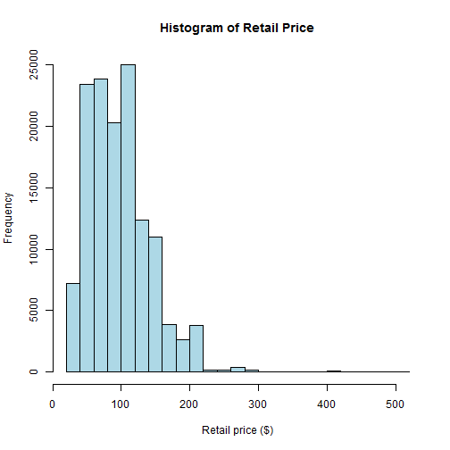

### Obtain data
##### Here I will fetch the data from the web and load it into R

```r
### DATA section
## Task 2: Get data
getwd()              # your working directory
```

```
## [1] "C:/URBA"
```

```r
setwd("C:\\URBA")    # change your working directory

## I commented out downloading the data here to save time!!
# downloand data from github repo into your machine's working directory
#download.file(url="https://raw.githubusercontent.com/MatthewALanham/URBA2/master/urba_pres_data.csv"
#              , destfile="urba_pres_data.csv")
# load data into R
data = read.csv("urba_pres_data.csv")
```

### Begin data analysis
##### Here I will begin the data analysis
- Basic summaries
- A historam of retail price

```r
## Task 3: Get data ready for analysis
names(data)
```

```
##  [1] "DC"                             "STORE_NUMBER"                  
##  [3] "LAT"                            "LONG"                          
##  [5] "STATE"                          "REGION"                        
##  [7] "STORE_AGE_YRS"                  "TOTAL_SQUARE_FEET"             
##  [9] "SKU_NUMBER"                     "SKU_DESCRIPTION"               
## [11] "PART_TYPE"                      "MPOG_SEGMENT"                  
## [13] "LENGTH"                         "WIDTH"                         
## [15] "HEIGHT"                         "WEIGHT"                        
## [17] "CUBIC_INCHES"                   "RETAIL_PRICE"                  
## [19] "UNIT_COST"                      "REORDER_POINT"                 
## [21] "ORDER_QTY_MAX"                  "VENDOR_NUMBER"                 
## [23] "VENDOR_NAME"                    "VENDOR_LEAD_TIME"              
## [25] "APPLICATION_COUNT"              "PLATFORM_CLUSTER_NAME"         
## [27] "TOTAL_VIO_CY"                   "TOTAL_VIO_PY"                  
## [29] "UNADJUSTED_TOTAL_VIO_CY"        "UNADJUSTED_TOTAL_VIO_PY"       
## [31] "SOLD_SINCE_MAXI"                "CY_SALES_SIGNAL"               
## [33] "PY_SALES_SIGNAL"                "BASE_SALES"                    
## [35] "ADJUSTED_SALES"                 "LOST_QTY_CY"                   
## [37] "LOST_QTY_PY"                    "SS_SALES_CY"                   
## [39] "SS_SALES_PY"                    "CY_QTY_SOLD"                   
## [41] "PY_QTY_SOLD"                    "PPY_QTY_SOLD"                  
## [43] "UNIT_SALES_PY"                  "UNIT_SALES_CY"                 
## [45] "UNIT_SALES_FY"                  "AVG_CLUSTER_CY_UNIT_SALES"     
## [47] "AVG_CLUSTER_PY_UNIT_SALES"      "AVG_CLUSTER_CY_LOST_SALES"     
## [49] "AVG_CLUSTER_PY_LOST_SALES"      "VIO_COMPARED_TO_CLUSTER"       
## [51] "ADJUSTED_AVG_CLUSTER_SALES_CY"  "VIO_COMPARED_TO_CLUSTER_PY"    
## [53] "ADJUSTED_AVG_CLUSTER_SALES_PY"  "AVG_CLUSTER_CY_TOTAL_SALES"    
## [55] "AVG_CLUSTER_PY_TOTAL_SALES"     "ADJ_AVG_CLUSTER_CY_LOST_SALES" 
## [57] "ADJ_AVG_CLUSTER_CY_TOTAL_SALES" "ADJ_AVG_CLUSTER_PY_LOST_SALES" 
## [59] "ADJ_AVG_CLUSTER_PY_TOTAL_SALES" "PROJECTED_GROWTH_PCT"          
## [61] "PROJECTED_GROWTH_PCT_PY"        "CY_PERIODS_IN_STOCK"           
## [63] "COMPETITOR_COUNT"               "COMPETITOR_INFLUENCE"          
## [65] "DIFM_DECILE"                    "DIY_STORE"                     
## [67] "SKU_COUNT_TARGET"               "PCT_COVERED"
```

```r
head(data, n=3)
```

```
##    DC STORE_NUMBER     LAT      LONG STATE REGION STORE_AGE_YRS
## 1 100          122 39.3399 -76.71553    MD     69      14.76115
## 2 100          122 39.3399 -76.71553    MD     69      14.76115
## 3 100          122 39.3399 -76.71553    MD     69      14.76115
##   TOTAL_SQUARE_FEET SKU_NUMBER SKU_DESCRIPTION PART_TYPE MPOG_SEGMENT
## 1              7400          1  product B 8600         B        WIGIT
## 2              7400          2  product B 8600         B        WIGIT
## 3              7400          3  product B 8600         B        WIGIT
##   LENGTH WIDTH HEIGHT WEIGHT CUBIC_INCHES RETAIL_PRICE UNIT_COST
## 1   3.60  5.30  20.20   5.20       385.42        77.89     25.75
## 2   3.60  5.30  20.20   5.20       385.42        77.89     25.75
## 3  18.11 14.77   5.32   6.38      1423.08       135.51     47.16
##   REORDER_POINT ORDER_QTY_MAX VENDOR_NUMBER VENDOR_NAME VENDOR_LEAD_TIME
## 1             1             3          9991       LARRY               16
## 2             0             1          9991       LARRY               16
## 3             0             1          9991       LARRY               16
##   APPLICATION_COUNT PLATFORM_CLUSTER_NAME TOTAL_VIO_CY TOTAL_VIO_PY
## 1                77                   127     72.50143     86.21767
## 2                77                   127     72.50143     86.21767
## 3               183                   127     92.34849    108.64608
##   UNADJUSTED_TOTAL_VIO_CY UNADJUSTED_TOTAL_VIO_PY SOLD_SINCE_MAXI
## 1                    7135                    7312               1
## 2                    7135                    7312               1
## 3                    9657                    9174               1
##   CY_SALES_SIGNAL PY_SALES_SIGNAL BASE_SALES ADJUSTED_SALES LOST_QTY_CY
## 1               3               0  0.6934436      0.8362819           0
## 2               2               0  0.6934436      0.8362819           0
## 3               2               1  1.5617726      1.8955814           0
##   LOST_QTY_PY SS_SALES_CY SS_SALES_PY CY_QTY_SOLD PY_QTY_SOLD PPY_QTY_SOLD
## 1           0           0           0           3           0            0
## 2           0           0           0           2           0            0
## 3           1           0           0           2           0            0
##   UNIT_SALES_PY UNIT_SALES_CY UNIT_SALES_FY AVG_CLUSTER_CY_UNIT_SALES
## 1          2825          4333          5056                  2.210526
## 2          2658          4287          4934                  1.894737
## 3          1133          2111          2411                  1.631579
##   AVG_CLUSTER_PY_UNIT_SALES AVG_CLUSTER_CY_LOST_SALES
## 1                 1.0000000                         0
## 2                 1.1428571                         0
## 3                 0.2857143                         0
##   AVG_CLUSTER_PY_LOST_SALES VIO_COMPARED_TO_CLUSTER
## 1                 0.0000000               0.8772728
## 2                 0.0000000               0.8772728
## 3                 0.2857143               0.8772728
##   ADJUSTED_AVG_CLUSTER_SALES_CY VIO_COMPARED_TO_CLUSTER_PY
## 1                      1.939235                  0.9134842
## 2                      1.662201                  0.9134842
## 3                      1.431340                  0.9134842
##   ADJUSTED_AVG_CLUSTER_SALES_PY AVG_CLUSTER_CY_TOTAL_SALES
## 1                     0.0000000                   2.210526
## 2                     0.0000000                   1.894737
## 3                     0.2609955                   1.631579
##   AVG_CLUSTER_PY_TOTAL_SALES ADJ_AVG_CLUSTER_CY_LOST_SALES
## 1                  1.0000000                             0
## 2                  1.1428571                             0
## 3                  0.5714286                             0
##   ADJ_AVG_CLUSTER_CY_TOTAL_SALES ADJ_AVG_CLUSTER_PY_LOST_SALES
## 1                       1.939235                     0.0000000
## 2                       1.662201                     0.0000000
## 3                       1.431340                     0.2609955
##   ADJ_AVG_CLUSTER_PY_TOTAL_SALES PROJECTED_GROWTH_PCT
## 1                      0.9134842            0.1668590
## 2                      1.0439819            0.1509214
## 3                      0.5219910            0.1421127
##   PROJECTED_GROWTH_PCT_PY CY_PERIODS_IN_STOCK COMPETITOR_COUNT
## 1               0.2079357                  13                0
## 2               0.2112058                  13                0
## 3               0.2206111                   7                0
##   COMPETITOR_INFLUENCE DIFM_DECILE DIY_STORE SKU_COUNT_TARGET PCT_COVERED
## 1                    0           4         0            17000    0.933907
## 2                    0           4         0            17000    0.933907
## 3                    0           4         0            17000    0.933907
```

```r
summary(data)                #summary of all variables
```

```
##        DC         STORE_NUMBER       LAT             LONG        
##  Min.   :100.0   Min.   :   1   Min.   :24.50   Min.   :-105.28  
##  1st Qu.:102.0   1st Qu.: 647   1st Qu.:35.65   1st Qu.: -85.69  
##  Median :104.0   Median :1296   Median :39.58   Median : -80.86  
##  Mean   :104.4   Mean   :1328   Mean   :37.94   Mean   : -82.01  
##  3rd Qu.:107.0   3rd Qu.:2043   3rd Qu.:41.33   3rd Qu.: -77.13  
##  Max.   :109.0   Max.   :2696   Max.   :46.69   Max.   : -68.38  
##                                                                  
##      STATE           REGION      STORE_AGE_YRS      TOTAL_SQUARE_FEET
##  PA     :14134   Min.   :50.00   Min.   : 0.01885   8000   :43355    
##  OH     :13583   1st Qu.:57.00   1st Qu.: 7.45159   #N/A   :10231    
##  FL     :13368   Median :64.00   Median :14.87605   7000   :10210    
##  NY     :10817   Mean   :64.57   Mean   :14.99263   0      : 3981    
##  VA     : 9519   3rd Qu.:72.00   3rd Qu.:20.61632   11000  : 3541    
##  NC     : 8753   Max.   :79.00   Max.   :66.88579   9075   : 2868    
##  (Other):64304                                      (Other):60292    
##    SKU_NUMBER           SKU_DESCRIPTION  PART_TYPE  MPOG_SEGMENT  
##  Min.   :  1.0   product A 1400 :77716   A:   264   WIGIT:134478  
##  1st Qu.:235.0   product B 8600 :43848   B:130455                 
##  Median :340.0   product B 8602 : 8624   C:  3759                 
##  Mean   :327.2   product C 2100a: 1612                            
##  3rd Qu.:486.0   product C 2100b: 1611                            
##  Max.   :570.0   product C 2100 :  536                            
##                  (Other)        :  531                            
##      LENGTH          WIDTH           HEIGHT           WEIGHT      
##  Min.   : 2.36   Min.   : 1.60   Min.   : 2.170   Min.   : 0.350  
##  1st Qu.: 5.75   1st Qu.:11.00   1st Qu.: 4.600   1st Qu.: 5.300  
##  Median :15.70   Median :12.99   Median : 6.020   Median : 8.360  
##  Mean   :13.64   Mean   :13.02   Mean   : 9.877   Mean   : 8.924  
##  3rd Qu.:19.90   3rd Qu.:17.32   3rd Qu.:14.750   3rd Qu.:10.340  
##  Max.   :40.37   Max.   :35.50   Max.   :52.750   Max.   :39.550  
##                                                                   
##   CUBIC_INCHES     RETAIL_PRICE      UNIT_COST      REORDER_POINT   
##  Min.   : 157.5   Min.   : 31.70   Min.   :  8.71   Min.   :0.0000  
##  1st Qu.: 519.5   1st Qu.: 64.23   1st Qu.: 20.06   1st Qu.:0.0000  
##  Median :1253.1   Median : 94.53   Median : 26.44   Median :0.0000  
##  Mean   :1292.9   Mean   : 98.15   Mean   : 31.51   Mean   :0.4008  
##  3rd Qu.:1756.2   3rd Qu.:125.53   3rd Qu.: 39.79   3rd Qu.:1.0000  
##  Max.   :4158.0   Max.   :510.70   Max.   :183.29   Max.   :1.0000  
##                                                                     
##  ORDER_QTY_MAX VENDOR_NUMBER  VENDOR_NAME   VENDOR_LEAD_TIME
##  Min.   :1.0   Min.   :9991   CURLY:18189   Min.   :16.00   
##  1st Qu.:1.0   1st Qu.:9991   LARRY:84802   1st Qu.:16.00   
##  Median :1.0   Median :9991   MOE  :31487   Median :16.00   
##  Mean   :1.6   Mean   :9992                 Mean   :30.78   
##  3rd Qu.:2.0   3rd Qu.:9992                 3rd Qu.:56.00   
##  Max.   :3.0   Max.   :9993                 Max.   :56.00   
##                                                             
##  APPLICATION_COUNT PLATFORM_CLUSTER_NAME  TOTAL_VIO_CY      
##  Min.   :   1.00   Min.   :  1.00        Min.   :   0.0006  
##  1st Qu.:  28.00   1st Qu.: 31.00        1st Qu.:  35.3963  
##  Median :  67.00   Median : 87.00        Median :  77.6369  
##  Mean   :  99.82   Mean   : 72.67        Mean   : 115.0883  
##  3rd Qu.: 110.00   3rd Qu.:109.00        3rd Qu.: 153.0219  
##  Max.   :1333.00   Max.   :130.00        Max.   :1490.1049  
##                                                             
##   TOTAL_VIO_PY       UNADJUSTED_TOTAL_VIO_CY UNADJUSTED_TOTAL_VIO_PY
##  Min.   :   0.0011   Min.   :     1          Min.   :     3         
##  1st Qu.:  39.0394   1st Qu.:  2748          1st Qu.:  3018         
##  Median :  83.6698   Median :  6326          Median :  6774         
##  Mean   : 121.3104   Mean   :  9703          Mean   : 10176         
##  3rd Qu.: 160.7776   3rd Qu.: 12745          3rd Qu.: 13418         
##  Max.   :1487.7854   Max.   :177703          Max.   :181102         
##                                                                     
##  SOLD_SINCE_MAXI  CY_SALES_SIGNAL PY_SALES_SIGNAL     BASE_SALES      
##  Min.   :0.0000   Min.   :-2.00   Min.   :-2.0000   Min.   : 0.00001  
##  1st Qu.:0.0000   1st Qu.: 0.00   1st Qu.: 0.0000   1st Qu.: 0.29834  
##  Median :1.0000   Median : 1.00   Median : 0.0000   Median : 0.71423  
##  Mean   :0.6962   Mean   : 1.26   Mean   : 0.9717   Mean   : 1.60488  
##  3rd Qu.:1.0000   3rd Qu.: 2.00   3rd Qu.: 1.0000   3rd Qu.: 1.95790  
##  Max.   :1.0000   Max.   :39.00   Max.   :35.0000   Max.   :35.06929  
##                                                     NA's   :257       
##  ADJUSTED_SALES     LOST_QTY_CY       LOST_QTY_PY       SS_SALES_CY       
##  Min.   : 0.0000   Min.   :0.00000   Min.   : 0.0000   Min.   :0.0000000  
##  1st Qu.: 0.3347   1st Qu.:0.00000   1st Qu.: 0.0000   1st Qu.:0.0000000  
##  Median : 0.8051   Median :0.00000   Median : 0.0000   Median :0.0000000  
##  Mean   : 1.7168   Mean   :0.09044   Mean   : 0.1363   Mean   :0.0006618  
##  3rd Qu.: 2.1406   3rd Qu.:0.00000   3rd Qu.: 0.0000   3rd Qu.:0.0000000  
##  Max.   :34.7175   Max.   :7.00000   Max.   :10.0000   Max.   :2.0000000  
##  NA's   :257                                                              
##   SS_SALES_PY         CY_QTY_SOLD      PY_QTY_SOLD       PPY_QTY_SOLD    
##  Min.   :0.0000000   Min.   :-2.000   Min.   :-2.0000   Min.   :-2.0000  
##  1st Qu.:0.0000000   1st Qu.: 0.000   1st Qu.: 0.0000   1st Qu.: 0.0000  
##  Median :0.0000000   Median : 1.000   Median : 0.0000   Median : 0.0000  
##  Mean   :0.0007585   Mean   : 1.169   Mean   : 0.8347   Mean   : 0.7833  
##  3rd Qu.:0.0000000   3rd Qu.: 1.000   3rd Qu.: 1.0000   3rd Qu.: 1.0000  
##  Max.   :2.0000000   Max.   :39.000   Max.   :35.0000   Max.   :30.0000  
##                                                                          
##  UNIT_SALES_PY   UNIT_SALES_CY   UNIT_SALES_FY   AVG_CLUSTER_CY_UNIT_SALES
##  Min.   :    0   Min.   :    0   Min.   :    0   Min.   :-0.07692         
##  1st Qu.:  577   1st Qu.:  530   1st Qu.:  511   1st Qu.: 0.14035         
##  Median : 1361   Median : 1526   Median : 1475   Median : 0.45454         
##  Mean   : 2341   Mean   : 2426   Mean   : 2509   Mean   : 0.81768         
##  3rd Qu.: 2656   3rd Qu.: 3082   3rd Qu.: 3661   3rd Qu.: 1.10811         
##  Max.   :13942   Max.   :12792   Max.   :13988   Max.   :10.52174         
##                                  NA's   :448                              
##  AVG_CLUSTER_PY_UNIT_SALES AVG_CLUSTER_CY_LOST_SALES
##  Min.   :-0.1429           Min.   :0.00000          
##  1st Qu.: 0.1176           1st Qu.:0.00000          
##  Median : 0.4074           Median :0.00000          
##  Mean   : 0.7464           Mean   :0.02652          
##  3rd Qu.: 1.0000           3rd Qu.:0.04000          
##  Max.   :15.8571           Max.   :0.57576          
##                                                     
##  AVG_CLUSTER_PY_LOST_SALES VIO_COMPARED_TO_CLUSTER
##  Min.   :0.00000           Min.   :0.2443         
##  1st Qu.:0.00000           1st Qu.:0.8110         
##  Median :0.00000           Median :1.0292         
##  Mean   :0.02766           Mean   :1.0804         
##  3rd Qu.:0.04167           3rd Qu.:1.2728         
##  Max.   :0.71429           Max.   :2.5199         
##                                                   
##  ADJUSTED_AVG_CLUSTER_SALES_CY VIO_COMPARED_TO_CLUSTER_PY
##  Min.   :-0.1283               Min.   :0.2388            
##  1st Qu.: 0.1478               1st Qu.:0.8149            
##  Median : 0.4587               Median :1.0277            
##  Mean   : 0.8346               Mean   :1.0798            
##  3rd Qu.: 1.0945               3rd Qu.:1.2752            
##  Max.   :18.5781               Max.   :2.5147            
##                                                          
##  ADJUSTED_AVG_CLUSTER_SALES_PY AVG_CLUSTER_CY_TOTAL_SALES
##  Min.   :0.00000               Min.   :-0.07692          
##  1st Qu.:0.00000               1st Qu.: 0.16667          
##  Median :0.00000               Median : 0.48571          
##  Mean   :0.02912               Mean   : 0.84420          
##  3rd Qu.:0.04361               3rd Qu.: 1.13333          
##  Max.   :1.04413               Max.   :10.60870          
##                                                          
##  AVG_CLUSTER_PY_TOTAL_SALES ADJ_AVG_CLUSTER_CY_LOST_SALES
##  Min.   :-0.1250            Min.   :0.00000              
##  1st Qu.: 0.1429            1st Qu.:0.00000              
##  Median : 0.4400            Median :0.00000              
##  Mean   : 0.7741            Mean   :0.02813              
##  3rd Qu.: 1.0000            3rd Qu.:0.04141              
##  Max.   :15.8571            Max.   :0.95630              
##                                                          
##  ADJ_AVG_CLUSTER_CY_TOTAL_SALES ADJ_AVG_CLUSTER_PY_LOST_SALES
##  Min.   :-0.1283                Min.   :0.00000              
##  1st Qu.: 0.1758                1st Qu.:0.00000              
##  Median : 0.4892                Median :0.00000              
##  Mean   : 0.8627                Mean   :0.02912              
##  3rd Qu.: 1.1261                3rd Qu.:0.04361              
##  Max.   :18.6400                Max.   :1.04413              
##                                                              
##  ADJ_AVG_CLUSTER_PY_TOTAL_SALES PROJECTED_GROWTH_PCT
##  Min.   :-0.2397                Min.   :-1.0000     
##  1st Qu.: 0.1526                1st Qu.:-0.1304     
##  Median : 0.4441                Median : 0.0273     
##  Mean   : 0.7914                Mean   : 0.0209     
##  3rd Qu.: 0.9948                3rd Qu.: 0.1612     
##  Max.   :23.1183                Max.   : 5.0000     
##                                 NA's   :448         
##  PROJECTED_GROWTH_PCT_PY CY_PERIODS_IN_STOCK COMPETITOR_COUNT
##  Min.   :-2.5833         Min.   : 0.000      Min.   :0.0000  
##  1st Qu.:-0.1619         1st Qu.: 0.000      1st Qu.:0.0000  
##  Median : 0.0709         Median :13.000      Median :1.0000  
##  Mean   : 0.0759         Mean   : 9.329      Mean   :0.9052  
##  3rd Qu.: 0.2079         3rd Qu.:13.000      3rd Qu.:1.0000  
##  Max.   : 3.6168         Max.   :13.000      Max.   :6.0000  
##  NA's   :553                                                 
##  COMPETITOR_INFLUENCE  DIFM_DECILE      DIY_STORE       SKU_COUNT_TARGET
##  Min.   :0.000        1      :19994   Min.   :0.00000   Min.   :10000   
##  1st Qu.:0.000        2      :15484   1st Qu.:0.00000   1st Qu.:13000   
##  Median :0.080        3      :14149   Median :0.00000   Median :17000   
##  Mean   :0.139        4      :14126   Mean   :0.04519   Mean   :18390   
##  3rd Qu.:0.220        5      :11864   3rd Qu.:0.00000   3rd Qu.:25000   
##  Max.   :0.880        (Other):49882   Max.   :1.00000   Max.   :34000   
##                       NA's   : 8979                     NA's   :9435    
##   PCT_COVERED    
##  Min.   :0.7084  
##  1st Qu.:0.9169  
##  Median :0.9351  
##  Mean   :0.9317  
##  3rd Qu.:0.9510  
##  Max.   :0.9957  
##  NA's   :56
```

```r
summary(data$RETAIL_PRICE)   #five number summary for retail price only
```

```
##    Min. 1st Qu.  Median    Mean 3rd Qu.    Max. 
##   31.70   64.23   94.53   98.15  125.50  510.70
```

```r
# a histogram of a variable
hist(data$RETAIL_PRICE
     ,main="Histogram of Retail Price"
     ,xlab="Retail price ($)"
     , col="lightblue")
```

 
